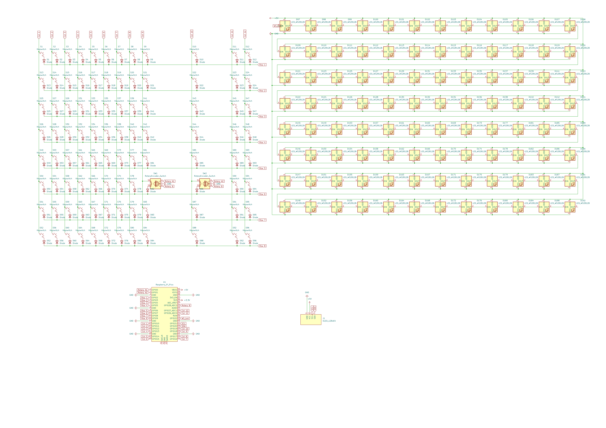
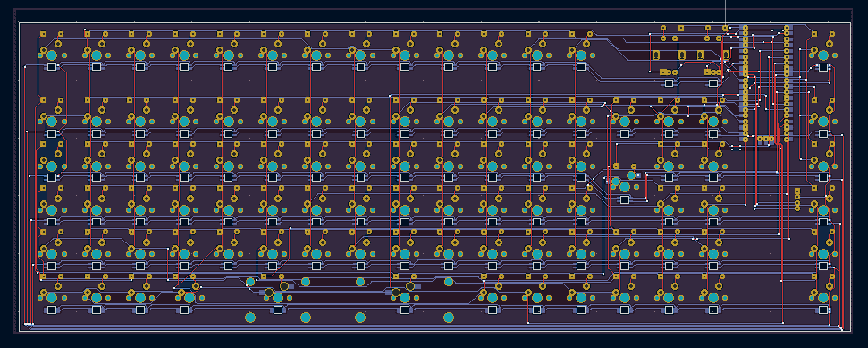

# my compact keyboard

## Description

## PCB
Here are pictures of my pcb:

| **Schematic** | **PCB** |
|---------------|---------|
|||

Hope it looks good to you!

[x] I ran DRC and there are 0 errors

## CAD
Designed two using OpenSCAD! I edited my previous macropad case for the keyboard

It's made to be 3D printed, and as it doesn't need supports nor any post processing, mass produce.

## Firmware

I wrote the firmware using kmk, you can see it inside the repo. It's pretty simple, but I'm proud of it!

## BOM
| **Quantity** | **Item**                          |
|--------------|-----------------------------------|
| 1            | Raspberry Pi Pico                |
| 91          | Switches                         |
| 3           | Hotwap sockets                   |
| 96           | 1N4148 diodes                    |
| 96           | LED_WS2812B                      |
| 1            | Audio Jack 4                     |
| 1            | SSD1306                          |
| 2            | Rotary encoder                   |
| 1           | keycaps set                        |
| 3            | stabilizers set                      |
| 9            | bolts and nuts                 |

## IMPORTANT

- Dont send the 3d printed case  
    I'll print it myself so I'll get less customs fees.
- Don't send the soldering iron  
  I have one, less electronics waste, less customs fees.
